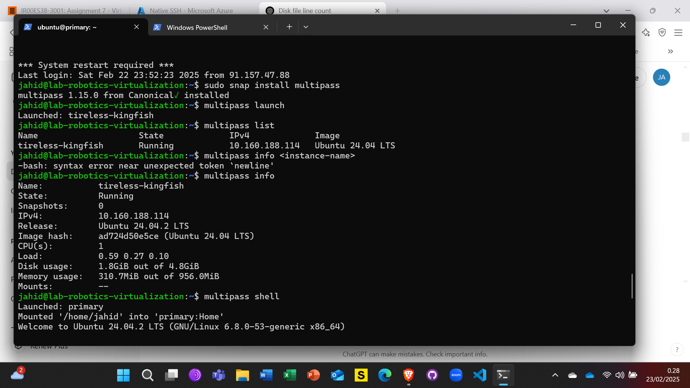
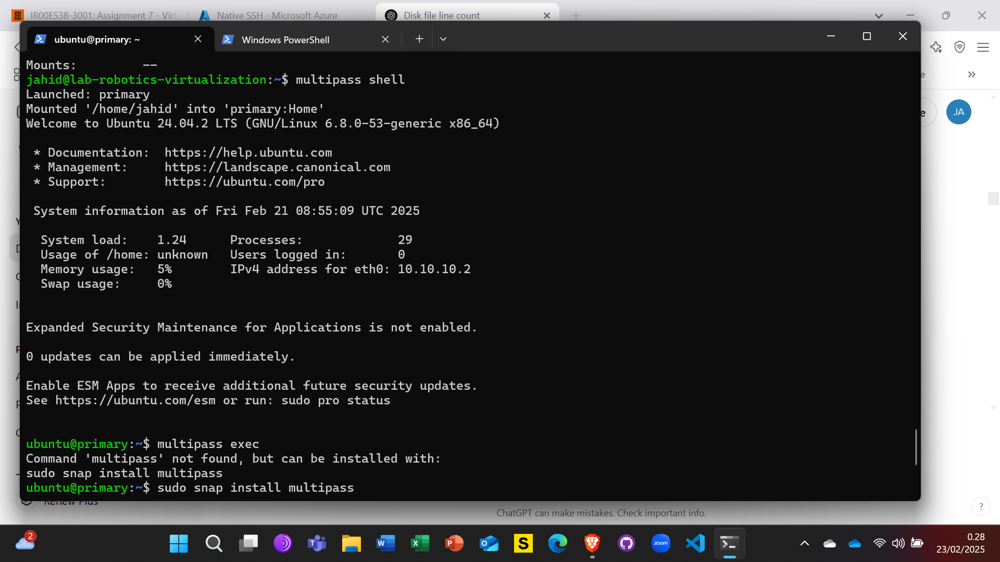
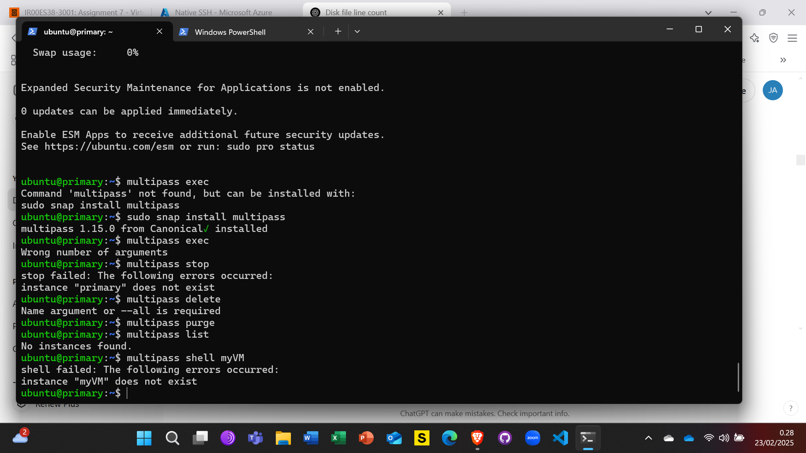
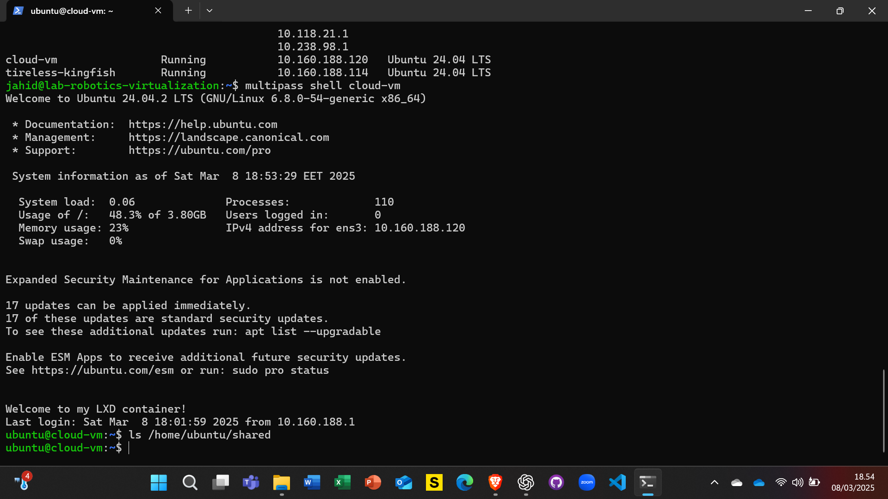
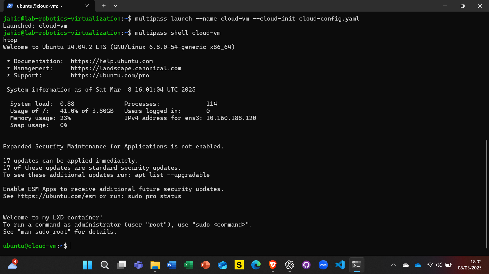
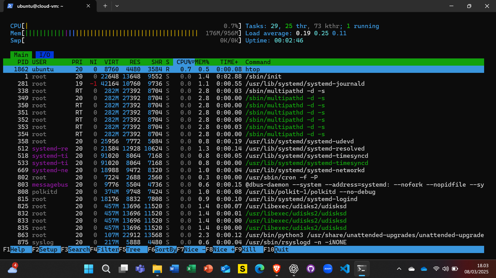
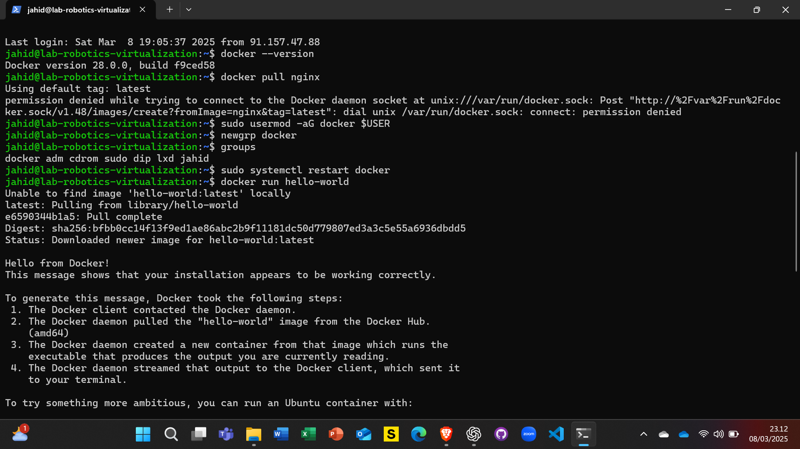
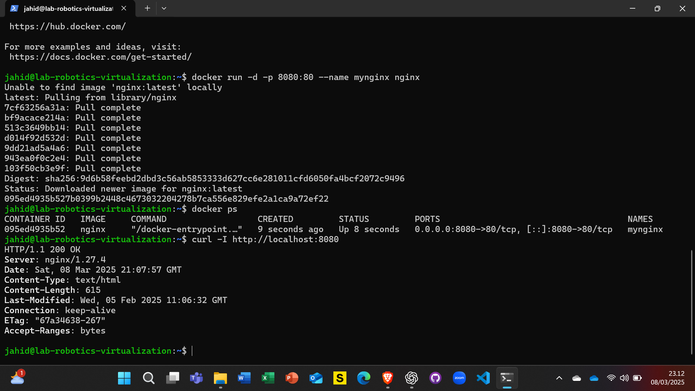
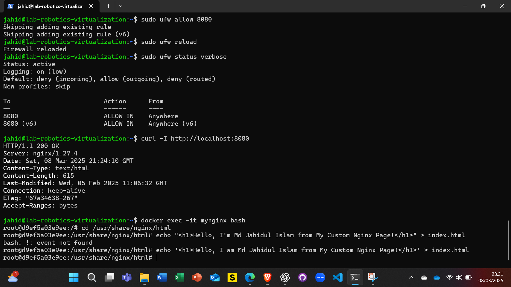
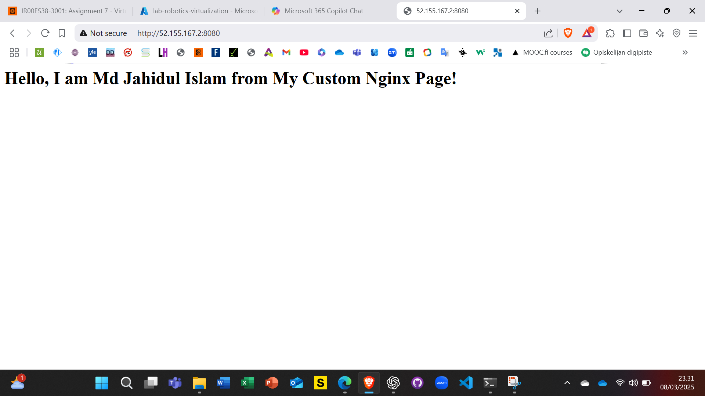

# Part 1: Virtualization
Virtualization is a technology that allows you to create multiple simulated environments or dedicated resources from a single, physi>

## Hypervisor
A hypervisor, also known as a virtual machine monitor (VMM), is software, firmware, or hardware that creates and runs virtual machin>

- Type 1 (Bare-metal): Runs directly on the host's hardware to manage guest operating systems (e.g., VMware ESXi, Microsoft Hyper-V).
- Type 2 (Hosted): Runs on a conventional operating system just like other software (e.g., VMware Workstation, Oracle VirtualBox).

## Virtual Machines (VMs)
A virtual machine (VM) is an emulation of a computer system. VMs run on hypervisors and provide the functionality of a physical comp>

## Containers
Containers are lightweight, portable, and self-sufficient units that include everything needed to run a piece of software, including>

## Here are the core differences between VMs and containers:

### Architecture:

*VMs:* Each VM runs a full operating system, including its own kernel, on top of the hypervisor. This makes VMs more resource-intens>*Containers:* Containers share the host system's kernel and run as isolated processes in user space. This makes containers more ligh>

### Resource Utilization:

*VMs:* Require more system resources (CPU, memory, storage) because each VM includes a full operating system.
*Containers:* Use fewer resources as they share the host system's kernel and only include the necessary libraries and dependencies.

### Isolation Levels:
*VMs:* Provide strong isolation as each VM is completely separated from the host and other VMs.
*Containers:* Offer lightweight isolation, which is sufficient for many applications but not as robust as VMs. Containers can be fur>

## Virtualization Summary File [Virtualization Summary](virtualization_summary.txt)

# Part 2: Working with Multipass

# Part 3: Exploring LXD

## Task 1: Install and Initialize LXD
### Install LXD:
sudo snap install lxd
### Set up LXD:
lxd init
Choose default settings.

## Task 2: Practice Basic LXD Commands
lxc launch ubuntu:24.04 mycontainer  # Launch an Ubuntu container
lxc list  # List running containers
lxc exec mycontainer -- bash  # Enter the container
lxc stop mycontainer  # Stop the container
lxc delete mycontainer  # Delete the container

# Part 4: Using Docker
## Task 1: Install Docker
sudo apt update
sudo apt install docker.io
sudo systemctl start docker
sudo systemctl enable docker

Verify installation:
docker --version

## Task 2: Run Docker Containers
docker pull nginx  # Download the Nginx image
docker run -d -p 8080:80 nginx  # Run Nginx in a container
docker ps  # List running containers
docker stop <container-id>  # Stop a container
docker rm <container-id>  # Remove a container
Opened http://localhost:8080 in my browser.
For the first time i couldn't open after in my VM i created one inbount rule then it works perfectly.

## Task 3: Create a Simple Dockerfile
Create a Dockerfile:
dockerfile
FROM ubuntu:24.04
RUN apt update && apt install -y python3
CMD ["python3", "--version"]

Build and run it:
docker build -t myubuntu .
docker run myubuntu

Checked in Nginx

# Part 5: Snaps for Self-Contained Applications
## Task 1: Research Snaps
## Task 2: Install Snapcraft and Create a Snap
Install Snapcraft:
sudo snap install snapcraft --classic

Create a simple snap package:
mkdir my-snap
cd my-snap
snapcraft init

Build the Snap:
snapcraft

Install and test the Snap:
sudo snap install my-snap --dangerous

*THE END*